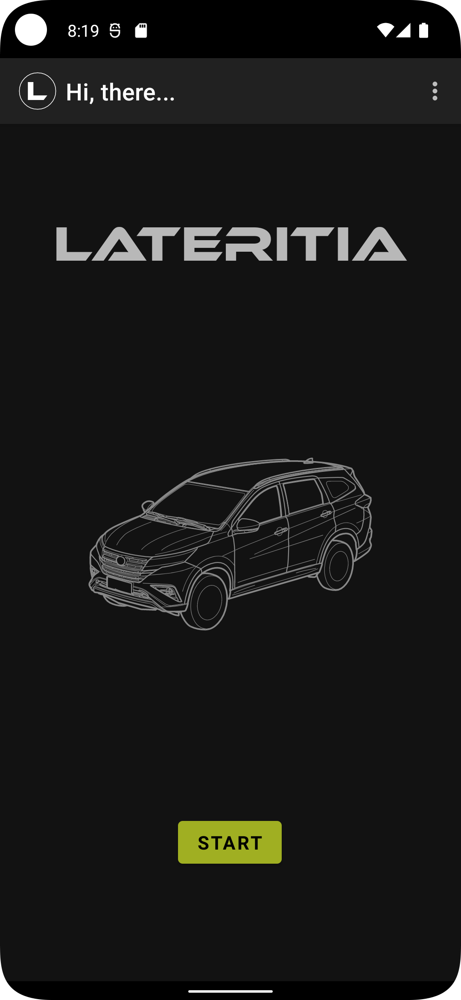

# Lateritia 

Lateritia is an app that helps you to accurately determine how much fuel your vehicle needs. It is made for the Toyota Rush (2019-2022 models). The App has been optimized to work on most android head units, so you can you use it in your vehicle while at the gas station.

## Screenshots

## Report Issues
Notice any issues with this repository? Please file a github issue in the repository.
